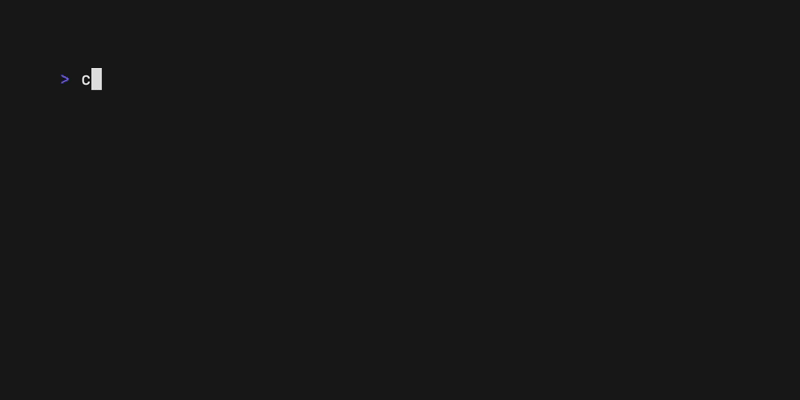

# rlisp

> **Hello, Hacker News.** You're not wrong. This is a weekend project, not a production compiler — some Rust syntax is missing (turbofish is fixed now, lifetime bounds are on the list). The point isn't completeness; it's exploring what happens when you bolt Lisp macros onto Rust semantics. If that sounds interesting, read on. If you're looking for something to be mad about, [the issue tracker is open](https://github.com/ThatXliner/rust-but-lisp/issues).

Rust semantics in LISP syntax. Write s-expressions, output Rust source: `(s-expr → .rs → binary)`.

```lisp
(struct Point
  (x f64)
  (y f64))

(impl Point
  (fn distance ((&self) (other &Point)) f64
    (let dx (- (. self x) (. other x)))
    (let dy (- (. self y) (. other y)))
    (. (+ (. dx powf 2.0) (. dy powf 2.0)) sqrt)))

(fn main () ()
  (let p1 (raw_new Point (x 0.0) (y 0.0)))
  (let p2 (raw_new Point (x 3.0) (y 4.0)))
  (println! "Distance: {}" (. p1 distance (& p2))))
```

Ownership, borrowing, lifetimes, generics, traits, pattern matching — all expressed as s-expressions. `rustc` still does type checking, borrow checking, and optimization. rlisp just handles the syntax.



Pretty diagnostics with [Ariadne](https://codeberg.org/zesterer/ariadne):


## Install

```bash
git clone https://github.com/ThatXliner/rust-but-lisp.git
cd rlisp
cargo install --path .
```

## Usage

```bash
rlisp compile file.lisp   # transpile to file.rs
rlisp build file.lisp     # transpile and compile with rustc
rlisp run file.lisp       # transpile, compile, and run
```

## Quick reference

| LISP | Rust |
|------|------|
| `(fn add ((x i32) (y i32)) i32 (+ x y))` | `fn add(x: i32, y: i32) -> i32 { (x + y) }` |
| `(let x 42)` / `(let mut x 42)` | `let x = 42;` / `let mut x = 42;` |
| `(struct Point (x f64) (y f64))` | `struct Point { x: f64, y: f64 }` |
| `(enum Option (generic T) (Some T) None)` | `enum Option<T> { Some(T), None }` |
| `(match val ((Some x) (handle x)) (None ()))` | `match val { Some(x) => { handle(x) }, None => { } }` |
| `(if (> x 0) (println! "yes") (println! "no"))` | `if (x > 0) { println!("yes") } else { println!("no") }` |
| `(impl Point ((fn new (...) ...)))` | `impl Point { fn new(...) ... }` |
| `(trait Display ((fn fmt (...) Result)))` | `trait Display { fn fmt(...) -> Result; }` |
| `(. obj field)` / `(. obj method arg)` | `obj.field` / `obj.method(arg)` |
| `(raw_new Point (x 1.0) (y 2.0))` | `Point { x: 1.0, y: 2.0 }` |
| `(lambda (x y) (+ x y))` | `\|x, y\| { x + y }` |
| `(for x in iter (body))` / `(loop (body))` / `(while cond (body))` | `for x in iter { body }` / `loop { body }` / `while cond { body }` |
| `(pub fn foo () i32 42)` | `pub fn foo() -> i32 { 42 }` |

Binary operators (`+`, `-`, `*`, `/`, `==`, etc.) emit infix: `(+ a b)` → `(a + b)`, `(+ a b c)` → `(a + b + c)`.

Kebab-case identifiers with hyphens are converted to `__` (double underscore): `page-header` → `page__header`. Collisions (e.g. `foo-bar` and `foo__bar` both → `foo__bar`) emit a warning.

**Full reference:** [SYNTAX.md](SYNTAX.md) covers generics, lifetimes, visibility, modules, turbofish, inline Rust, const/static, if-let, while-let, else-if, match guards, derive, where clauses, supertraits, associated types, type aliases, and more.

## Macros

rlisp macros are compile-time s-expression transformers — no `proc_macro` crate, no token streaming, no syn/quote. A macro is just a function from s-expressions to s-expressions.

Macro bodies use three special forms borrowed from LISP:

| Form | Meaning |
|------|---------|
| `(quasiquote template)` | "Quote this template, but allow unquotes inside" — like a tagged template literal |
| `(unquote name)` | "Insert the value of `name` here" — a hole in the template |
| `(unquote-splicing name)` | "Splice the list `name` into the surrounding list" — for inserting multiple forms |

Think of `quasiquote` as "return this exact s-expression, except for the `unquote` holes." Without it, you'd have to manually construct every parenthesis with `list` and `cons`.

```lisp
;; Define a when macro: (when condition body...)
(defmacro when (condition &rest body)
  (quasiquote (if (unquote condition) (do (unquote-splicing body)))))

;; Macro expansion:
;;   (when (> x 10) (print "big") (print "huge"))
;; → (if (> x 10) (do (print "big") (print "huge")))
;; → if x > 10 { print("big"); print("huge") }

(defmacro double (x)
  (quasiquote (+ (unquote x) (unquote x))))

;; (double 21) → (+ 21 21) → 21 + 21

(fn main () ()
  (let x 21)
  (println! "Double: {}" (double x))
  (when (> x 10)
    (println! "x is greater than 10")
    (println! "this too")))
```

`&rest` captures all remaining arguments into a list, and `unquote-splicing` flattens that list into the surrounding form. This is how variadic macros work.

## Loops

```lisp
(while (> x 0)
  (println! "{}" x)
  (-= x 1))

(loop (println! "tick"))

(for x in 0..10
  (println! "{}" x))

;; for with destructuring (double parens for tuple patterns)
(for ((i val)) in (. v iter) enumerate
  (println! "{}: {}" i val))
```

## Closures

```lisp
;; untyped
(let add (lambda (x y) (+ x y)))

;; typed with return type
(let mul (lambda ((x i32) (y i32)) i32 (* x y)))

;; move closure
(let s "hello")
(let greet (lambda move () (println! "{}" s)))
```

## Modules, visibility, and imports

```lisp
(pub fn public_api () i32 42)
(pub (crate) fn internal () i32 0)       ;; pub(crate)
(pub (super) fn parent_visible () i32 1)  ;; pub(super)

(pub struct Config
  (pub host String)                        ;; public field
  (port u16))                              ;; private field

(pub mod utils (                          ;; inline module
  (pub fn helper () i32 1)
  (fn private () i32 0)))

(mod external_lib)                        ;; external module decl

(use std::collections::HashMap)
(use std::io::{self,Write,Read})
(use std::fmt::Display as Fmt)
```

## Inline Rust

Drop into raw Rust with `(rust "...")` for anything rlisp doesn't express natively.
The string is emitted verbatim into the generated `.rs` file (with LISP escape sequences unescaped):

```lisp
(fn raw_example () i32
  (rust "let x: i32 = 42; x * 2"))

(fn main () ()
  (rust "let message: &str = \"from raw Rust\";")
  (println! "{}" (rust "message")))
```

## Lifetimes, turbofish, and control flow

```lisp
;; Lifetime annotations on function definitions
(fn longest (generic 'a) ((x &'a str) (y &'a str)) (&'a str)
  (if (> (. x len) (. y len)) x y))

;; Turbofish via :: special form
(let nums ((:: (. (0..10) collect) Vec<i32>)))

;; Break, continue, return
(for x in 0..10
  (if (== x 5) (break))
  (if (== x 3) (continue))
  (println! "{}" x))

;; Type casts
(let pi 3.14159)
(let approx (as pi u32))

;; if-let and while-let
(if-let (Some v) (. map get key)
  (println! "found: {}" v)
  (println! "missing"))

(while-let (Some v) ((. iter next))
  (println! "{}" v))

;; Unsafe blocks
(unsafe
  (rust "let ptr: *const i32 = &42;")
  (rust "*ptr"))
```

## Why

Mostly for fun. I wanted to see what Rust feels like with the syntax stripped away but the type system and borrow checker still there.

**Macros** are the obvious practical win: in LISP they're just functions that return s-expressions, running at compile time. No proc_macro, no token streaming. You write `defmacro`, you get quasiquote, you're done.

**Structural editing** is another thing you don't appreciate until you try it. S-expressions are trivially balanced. You can't accidentally leave a brace dangling.

And **the uniformity** grows on you. Expressions, types, patterns, statements — they all look the same. A function signature uses the same syntax as a match arm. It's less to keep in your head.

## Support

Hey, if you like this project and read this far, consider starring it on GitHub! 

Additionally, please check out some of my more serious projects, namely [Xclif](https://github.com/ThatXliner/xclif) (file-based routing CLI framework), and [Quillium](https://quillium.bryanhu.com?utm_source=github&utm_medium=readme&utm_id=rust-but-lisp) (inline branching for prose; think Git for writing)

## License

MIT
